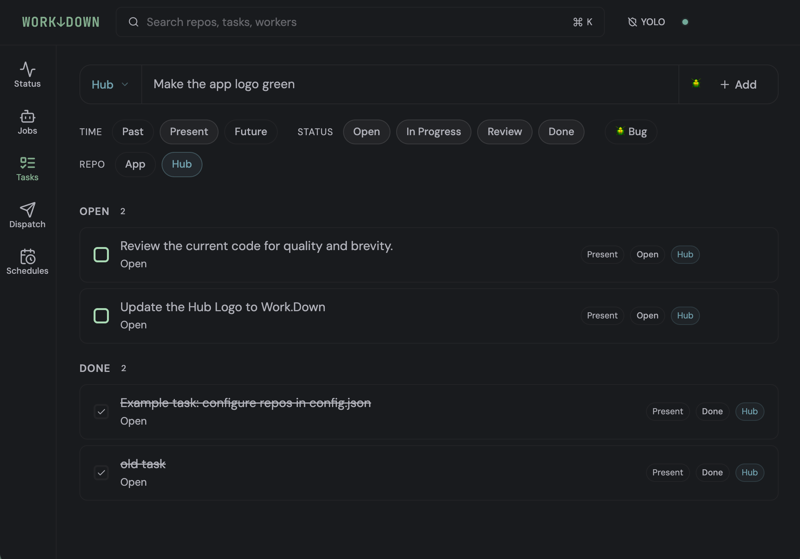
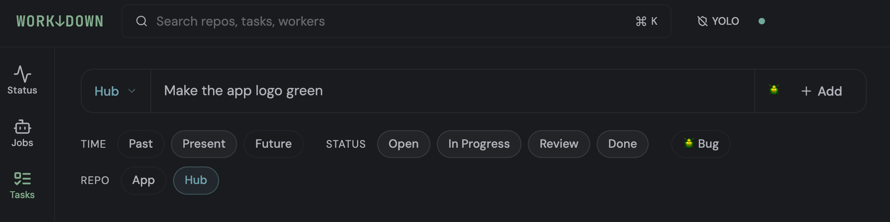
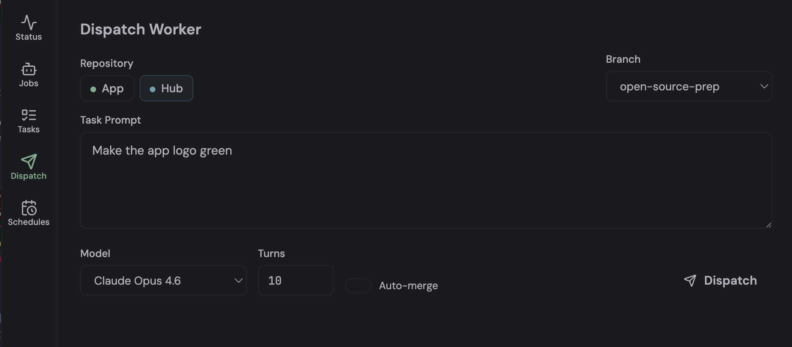
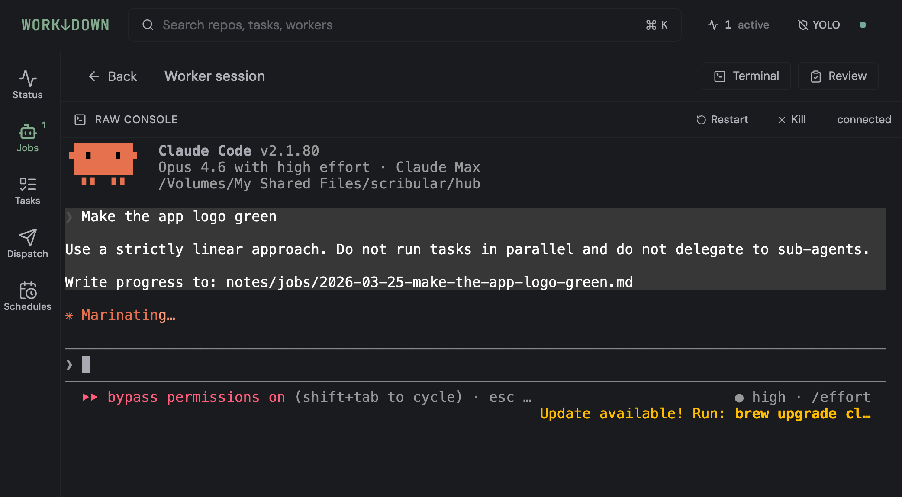
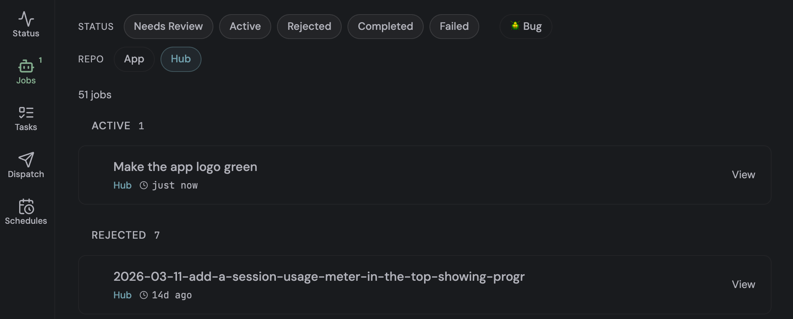
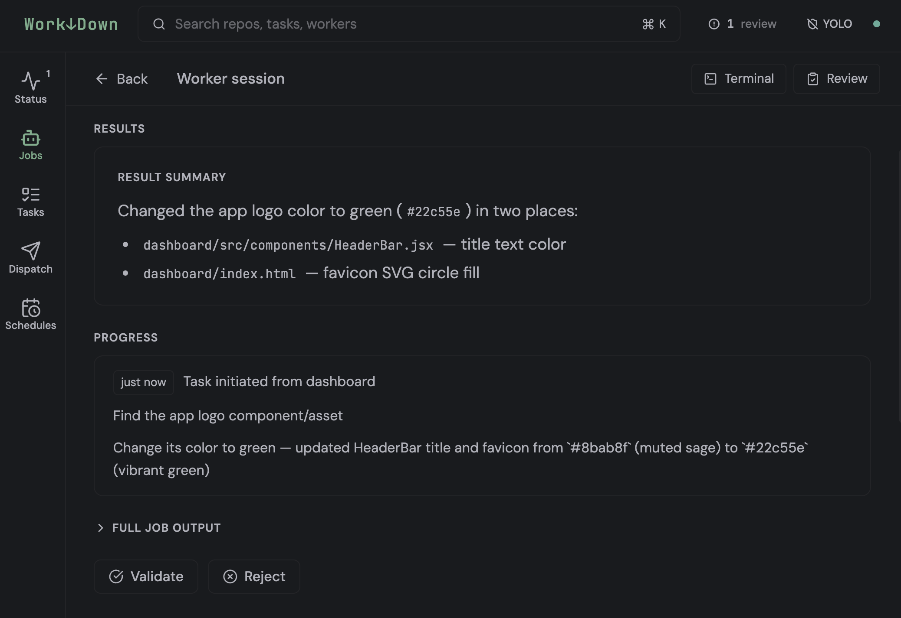

# Work↓Down

**Agents for your Markdown Files, not the other way around.**


Markdown-based coordination for Claude Code, Codex, and other AI agents. Tasks live in plain markdown files you already have. Work.Down gives you a dashboard to dispatch agents, track their progress, and automatically close out the work when you validate it — without touching your existing setup.



> **Experimental / testing grounds.** This is a working prototype, not a finished product, and Claude YOLO mode is enabled by default. Expect rough edges. 

## Principles

- Work↓Down doesn't interfere with your existing setup. Simple and lightweight.
- Markdown files (.md) are the source of truth. No new file formats or data structures.
- Each task is worked on by a single agent. No parallelization or sub-agents.

## What it does

- **Task dashboard** — open tasks and activity across all your repos in one place
- **Agent dispatch** — start Claude Code sessions from the dashboard, track terminal output live
- **Auto-completion** — validating a job marks the task done in `todo.md` and logs it to `activity-log.md` automatically
- **Job history** — every agent run is logged to a markdown file in `notes/jobs/`
- **CLI** — JSON output for scripting and agent-to-agent queries

## Task lifecycle

**1. Write a task**

Add a task to `todo.md` in any connected repo,

```markdown
- [ ] Change the app logo to green 
```

or via the dashboard.




**2. Dispatch from the dashboard**

Click "Start" on a task to open the pre-filled dispatch form. Review, edit, send.



**3. Agent works**

A terminal session opens in that repo with your prompt, writing incremental progress to the job file as it goes. You can watch the terminal live or come back later.



**4. Review**

When the agent finishes, the job moves to the review queue. Open the job to read the progress log and see what changed.



**5. Validate**

Click Validate in the dashboard. Work.Down automatically:
- Marks the task done in `todo.md`
- Logs an entry to `activity-log.md`

The job file in `notes/jobs/` stays as a permanent record.




---

## What gets installed where

The full list. Nothing is installed globally. 

**In the Work.Down directory:**

| What | Path |
|------|------|
| Dashboard (React + Express) | `dashboard/` |
| CLI + parsers | `cli.js`, `parsers.js` |
| Claude skills (`/workdown`, `/add-repo`, `/done`) | `.claude/skills/` |

**In each repo you connect (via `/add-repo`):**

| What | Path |
|------|------|
| `hub-stop.js` hook | `.claude/hooks/` |
| `protect-env.js` hook | `.claude/hooks/` |
| Hook registration | `.claude/settings.json` (merged with any existing config) |
| `todo.md`, `bugs.md`, `activity-log.md` | repo root (only created if missing) |

`hub-stop.js` is a no-op unless Work.Down dispatched that Claude session. It won't affect normal Claude usage in your repos.

---

## Setup

### 0. Install tmux (strongly recommended)

> **tmux keeps your agent sessions alive across dashboard restarts.** Without it, any running Claude session will be killed whenever the dashboard server restarts (e.g. after a code change). With it, sessions survive restarts and reconnect automatically.

```bash
# macOS
brew install tmux

# Ubuntu/Debian
sudo apt install tmux
```

Work.Down automatically uses tmux when available and falls back gracefully if it isn't installed.

### 1. Clone and install

```bash
git clone https://github.com/your-org/workdown
cd workdown/dashboard && yarn install && cd ..
```

### 2. Open in Claude Code

```bash
claude .
```

### 3. Connect your repos

In the Claude Code conversation, run:

```
/add-repo
```

Claude will ask for the repo name, path, and optional scripts, then set everything up in that repo. Repeat for each repo you want to track.

### 4. Start the dashboard

```bash
cd dashboard && yarn dev
```

Open [http://localhost:5173](http://localhost:5173).

---

## How it works

1. Open tasks in your repos' `todo.md` files appear in the dashboard
2. Click a task to dispatch a Claude Code agent — it opens a terminal session in that repo
3. The agent writes progress to `notes/jobs/YYYY-MM-DD-slug.md` as it works
4. When you validate the job in the dashboard, Work.Down automatically:
   - Marks the task done in `todo.md`
   - Logs an entry to `activity-log.md`

Your markdown files stay the source of truth throughout. The dashboard is a lens over them.

---

## File formats

Work.Down reads and writes standard markdown. If you already have these files, they'll be picked up as-is.

### Tasks — `todo.md`

```markdown
## Open

- [ ] Add input validation to the API
- [ ] Write tests for auth module

## Done

- [x] Set up CI pipeline
```

### Bugs — `bugs.md`

```markdown
## Open

- [ ] Login fails on Safari

## Fixed

- [x] 500 error on empty form submit
```

### Activity — `activity-log.md`

Updated automatically when you validate a job. Also writable via `/done`.

```markdown
# My Repo — Activity Log

**Current stage:** MVP

## 2026-03-24

- **Added auth module** — JWT-based auth with refresh tokens
```

---

## CLI reference

```bash
node cli.js status              # Overview of all repos
node cli.js tasks               # All open tasks across repos
node cli.js tasks --repo=app    # Tasks for one repo
node cli.js swarm               # Active and recent agent jobs
node cli.js repos               # List configured repos
node cli.js config              # Dump full resolved config
```

All output is JSON — designed for scripting and agent consumption.

---

## Claude skills

Three skills are active when Claude Code is opened in the Work.Down directory:

| Skill | Invoke | What it does |
|-------|--------|--------------|
| `/workdown` | `/workdown` or "what should I work on?" | A CLI view of your markdown files — tasks, activity, and what to work on next |
| `/add-repo` | `/add-repo` | Connect a new repo to Work.Down |
| `/done` | `/done` or "we're done" | Mark a task done and log activity manually |

`/done` is for work done outside the dashboard — manual sessions, ad-hoc fixes, anything not dispatched through the UI.

---

## Future improvements

- Better agent lifecycle management (tmux-backed persistence is implemented; orphan cleanup is ongoing)
- Support for other AI agents, eg. Codex, Cursor, etc.


